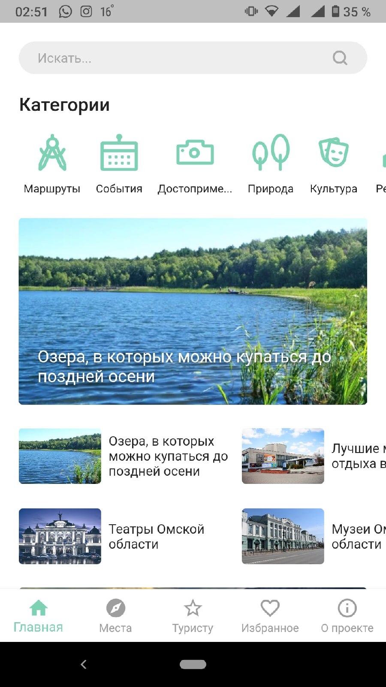

# Путеводитель по Омской области

Путеводитель, работающий офлайн. Данные создаются и редактируются на сервере, а затем получаются оттуда.
Скачиваются при первом запуске.

`lib/api` - методы для работы с api сервера\
`lib/bloc` - bloc \
`lib/database` - база данных\
`lib/screens` - экраны
`lib/widgets` - виджеты

`pubspec.yaml` - зависимости\
`flutter pub get` - установить зависимости\
`flutter build apk` - собрать apk\

